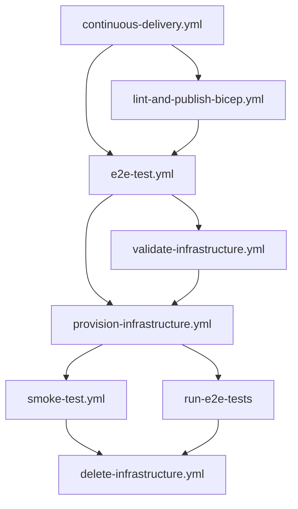

The repository ships a multi-stage GitHub Actions pipeline that validates Bicep infrastructure, provisions a real Azure environment, runs smoke tests against it, and tears everything down. This page explains how the pipeline works, how to configure the GitHub environment, and how the smoke tests derive project names from the attendee list.

## Pipeline architecture

The pipeline is composed of seven reusable workflow files that chain together through a single orchestrator. The diagram below shows the call graph for a push to `main`.



## Workflow reference

| File | Trigger | Purpose |
|------|---------|---------|
| `continuous-delivery.yml` | Push to `main`, version tags, `workflow_dispatch` | Orchestrator: sequences all other workflows |
| `lint-and-publish-bicep.yml` | Called by CD | Validates and lints every `.bicep` file |
| `e2e-test.yml` | Called by CD | Coordinates validate, provision, smoke, and teardown |
| `validate-infrastructure.yml` | Called by E2E | Runs `azd provision --preview` to catch template errors before spending money |
| `provision-infrastructure.yml` | Called by E2E | Runs `azd provision` to create real Azure resources and assign roles |
| `smoke-test.yml` | Called by E2E | Runs Pester smoke tests against the provisioned environment |
| `delete-infrastructure.yml` | Called by E2E (`if: always()`) | Deletes the resource group and purges soft-deleted resources |

### continuous-delivery.yml

The orchestrator runs on every push to `main` and on any `v*` tag. It computes a short build version from `GITHUB_SHA` and passes it downstream. All secrets flow through this file to the callee workflows via the `secrets: inherit` mechanism.

The `concurrency` group <code v-pre>continuous-delivery-${{ github.ref }}</code> prevents two simultaneous
runs against the same branch. The group does **not** cancel in progress, ensuring teardown
always completes.

### validate-infrastructure.yml

Authenticates with Azure using OIDC federated credentials, creates an ephemeral `azd` environment, sets all attendee and capability-host variables from the GitHub environment, and calls `azd provision --preview`. No resources are created; this is a what-if validation only.

The workflow is scoped to the <code v-pre>${{ inputs.ENVIRONMENT }}</code> GitHub environment so that all
`vars.*` overrides apply.

### provision-infrastructure.yml

Creates the `azd` environment, sets all variables, calls `azd provision` (which runs the
post-provision hook to assign Foundry RBAC roles), verifies the audit CSV, and finally
emits the `AZURE_RESOURCE_GROUP` output for downstream steps.

After provisioning, a Python inline script reads the audit CSV produced by `scripts/assign-attendee-roles.py` and fails the job if any role assignment has `status=failed`.

### smoke-test.yml

Installs Pester 5.5+, assembles a container-data hashtable from environment variables, and
invokes `tests/smoke/Smoke.Tests.ps1` through a `New-PesterContainer`. Results are written as NUnit XML and uploaded as a build artefact named `smoke-test-results-<ENVIRONMENT>`.

### delete-infrastructure.yml

Deletes the resource group, then purges any soft-deleted Key Vault and Cognitive Services
(Foundry) accounts so the environment name is immediately reusable. Runs under `if: always()` so teardown fires even when smoke tests fail.

## GitHub environment configuration

The pipeline reads configuration exclusively from the `test` GitHub environment (Settings > Environments > test). No secrets or variables are hardcoded in workflow files.

### Required secrets

| Secret | Description |
|--------|-------------|
| `AZURE_TENANT_ID` | Microsoft Entra tenant ID |
| `AZURE_SUBSCRIPTION_ID` | Azure subscription ID |
| `AZURE_CLIENT_ID` | Client ID of the managed identity with federated OIDC credentials |

The managed identity needs `Owner` or `Contributor + User Access Administrator` on the target subscription so it can create resource groups and assign Foundry RBAC roles.

It also needs the `User.ReadBasic.All` Microsoft Graph application permission so that `scripts/assign-attendee-roles.py` and `tests/smoke/Smoke.Tests.ps1` can resolve attendee UPNs to Entra object IDs via `az ad user show`.

### Granting User.ReadBasic.All to the managed identity

This is a Microsoft Graph app role assignment, not an Azure RBAC role, so it must be applied through the Microsoft Graph API. Run the following commands once per managed identity after it is created. The caller must have the `Application Administrator` or `Global Administrator` Entra role, or hold the `AppRoleAssignment.ReadWrite.All` Graph permission.

```powershell
# Look up the Graph service principal object ID in this tenant
$graphSpId = az ad sp show --id "00000003-0000-0000-c000-000000000000" --query id -o tsv

# Look up the exact app role ID for User.ReadBasic.All from this tenant's Graph service principal
$appRoleId = az ad sp show --id "00000003-0000-0000-c000-000000000000" `
    --query "appRoles[?value=='User.ReadBasic.All'].id | [0]" -o tsv

# Object ID of the managed identity's service principal
$miObjectId = "<object-id-of-managed-identity>"

# Write the request body to a temp file to avoid PowerShell JSON-escaping issues
"{`"principalId`":`"$miObjectId`",`"resourceId`":`"$graphSpId`",`"appRoleId`":`"$appRoleId`"}" `
    | Out-File -FilePath "$env:TEMP\graph-body.json" -Encoding utf8 -NoNewline

az rest --method POST `
    --uri "https://graph.microsoft.com/v1.0/servicePrincipals/$miObjectId/appRoleAssignments" `
    --headers "Content-Type=application/json" `
    --body "@$env:TEMP\graph-body.json"
```

> [!NOTE]
> The `User.ReadBasic.All` app role ID varies by tenant. Always query it from the Graph service principal in your tenant rather than hardcoding a GUID.

### Variables reference

All variables use the pattern `vars.VAR_NAME || 'default'` in workflow files, so omitting a variable from the environment is equivalent to accepting the default.

#### Azure environment

| Variable | Default | Description |
|----------|---------|-------------|
| `AZURE_LOCATION` | `eastus2` | Azure region for all resources |
| `AZURE_ENV_NAME` | Derived from run ID | Overrides the auto-generated environment name |

#### Attendee roster

| Variable | Default | Description |
|----------|---------|-------------|
| `AZURE_ATTENDEE_LIST` | `''` | Single-line JSON array of attendees. When set, takes precedence over `AZURE_ATTENDEE_COUNT`. |
| `AZURE_ATTENDEE_COUNT` | `2` | Number of standard attendee projects to create when no list is provided. |
| `AZURE_ATTENDEE_DEFAULT_ROLE` | `foundry-user` | Role key applied to attendees with no explicit `role` field. |

#### Project prefixes

| Variable | Default | Description |
|----------|---------|-------------|
| `AZURE_ATTENDEE_PROJECT_PREFIX` | `attendee` | Prefix for standard attendee projects (`attendee-01`, `attendee-02`, ...). |
| `AZURE_FACILITATOR_PROJECT_PREFIX` | `facilitator` | Prefix for facilitator projects. |
| `AZURE_PROCTOR_PROJECT_PREFIX` | `proctor` | Prefix for proctor projects. |
| `AZURE_ORGANIZER_PROJECT_PREFIX` | `organizer` | Prefix for organizer projects. |
| `AZURE_ENSURE_FACILITATOR_PROJECT` | `true` | When `true`, always provisions at least one facilitator project even when no facilitator appears in `AZURE_ATTENDEE_LIST`. |

#### Capability hosts

| Variable | Default | Description |
|----------|---------|-------------|
| `AZURE_AI_SEARCH_CAPABILITY_HOST` | `false` | Provision Azure AI Search and wire it as a vector-store capability host. |
| `AZURE_COSMOS_DB_CAPABILITY_HOST` | `false` | Provision Cosmos DB and wire it as a thread-storage capability host. |
| `AZURE_STORAGE_ACCOUNT_CAPABILITY_HOST` | `false` | Provision a Storage Account and wire it as a file-storage capability host. |

## Attendee list format and project derivation

`AZURE_ATTENDEE_LIST` is a single-line JSON array. The value is passed to `azd env set` and read by Bicep (project creation) and the pre-provision hook (UPN resolution). The pre-provision hook emits `AZURE_ATTENDEE_LIST_RESOLVED` with resolved Entra object IDs and precomputed project names; Bicep reads that resolved list to create RBAC role assignments at deploy time.

### Attendee object fields

| Field | Required | Default | Description |
|-------|----------|---------|-------------|
| `upn` | Yes | — | Microsoft Entra UPN, resolved to an object ID at provisioning time. |
| `role` | No | `AZURE_ATTENDEE_DEFAULT_ROLE` | Role key. See the [role catalog](../guide-organizer.md#role-catalog). |
| `individualProject` | No | `true` | `false` shares the first standard project rather than creating a dedicated one. |
| `projectName` | No | `<prefix>-NN` | Explicit project name overrides the auto-generated name. |

### Per-role-group indexing

Attendees are filtered into four groups before project names are derived. The index `i` within each group starts at `1` and resets independently for each group:

| Group | Roles | Default prefix | Example |
|-------|-------|---------------|---------|
| Standard | anything except facilitator, proctor, organizer | `AZURE_ATTENDEE_PROJECT_PREFIX` | `attendee-01` |
| Facilitator | `facilitator` | `AZURE_FACILITATOR_PROJECT_PREFIX` | `facilitator-01` |
| Proctor | `proctor` | `AZURE_PROCTOR_PROJECT_PREFIX` | `proctor-01` |
| Organizer | `organizer` | `AZURE_ORGANIZER_PROJECT_PREFIX` | `organizer-01` |

The final project list concatenates groups in order: standard, facilitator, proctor, organizer. This is the same ordering Bicep uses in `allProjectNames` inside `infra/main.bicep`.

### EnsureFacilitatorProject

When `AZURE_ENSURE_FACILITATOR_PROJECT=true` (the default) and `AZURE_ATTENDEE_LIST` contains no entry with `role=facilitator`, Bicep and the smoke test both guarantee that
`<facilitatorPrefix>-01` appears in the project list. This ensures a facilitator project always exists even when the list is attendee-only.

## Smoke test validation logic

`tests/smoke/Smoke.Tests.ps1` is a Pester 5 container-based test that receives all configuration through the `New-PesterContainer -Data` hashtable, allowing the same script to validate any roster without code changes.

### BeforeDiscovery: project name derivation

`BeforeDiscovery` reconstructs `$script:ProjectNames` and `$script:AttendeeTestCases` by
mirroring the Bicep variable derivation exactly:

1. Parse `$AttendeeList` into an array.
1. Iterate the array and sort each entry into its role group (standard, facilitator, proctor, organizer), tracking a per-group counter that starts at `0`.
1. For each entry, derive the project name using the group counter as the index (`counter + 1` zero-padded to two digits), or use the explicit `projectName` field if present.
1. The standard group counter advances for every standard entry, including those with `individualProject: false`, matching Bicep's loop index.
1. Apply `EnsureFacilitatorProject`: if no facilitator entries produced names, add `<facilitatorPrefix>-01` to the facilitator names.
1. Concatenate groups: standard, facilitator, proctor, organizer.

This derivation produces identical names to those Bicep creates in Azure, so the smoke test assertions reference resources that actually exist.

### Describe blocks

| Describe block | Skip condition | What it validates |
|----------------|---------------|-------------------|
| `Resource Group` | Never | Exists and `provisioningState=Succeeded` |
| `Foundry Account` | Never | Exists and `provisioningState=Succeeded` |
| `Foundry Projects` | Never | Each name in `$script:ProjectNames` exists and is `Succeeded` |
| `Model Deployments` | Never | `chat` and `embedding` deployments exist and are `Succeeded` |
| `Attendee Role Assignments` | `$script:AttendeeTestCases.Count -eq 0` | Each UPN has the correct Foundry role at the correct scope |
| `Key Vault` | Never | Exists and `provisioningState=Succeeded` |
| `AI Search` | `-not $AiSearchEnabled` | Exists and `provisioningState=Succeeded` |
| `Cosmos DB` | `-not $CosmosDbEnabled` | Exists and `provisioningState=Succeeded` or `Online` |
| `Storage Account` | `-not $StorageAccountEnabled` | Exists and `provisioningState=Succeeded` |

### Role assignment validation

For each attendee in `$script:AttendeeTestCases`, the test:

1. Resolves the UPN to an Entra object ID via `az ad user show`.
1. Looks up the role definition ID from the hardcoded `$script:RoleDefinitions` table.
1. Determines the scope: `project` scope becomes the full ARM resource ID of the attendee's project; `account` scope is the Foundry account resource ID.
1. Calls `az role assignment list` and asserts the assignment count is greater than zero.

## 6-user reference scenario

The `test` environment is configured with the following attendee list that maps the six lab accounts shown in the Azure portal to their respective roles and projects:

```json
[
  {"upn":"lab.attendee.1@MngEnvMCAP199525.onmicrosoft.com"},
  {"upn":"lab.attendee.2@MngEnvMCAP199525.onmicrosoft.com"},
  {"upn":"lab.attendee.3@MngEnvMCAP199525.onmicrosoft.com"},
  {"upn":"lab.facilitator.1@MngEnvMCAP199525.onmicrosoft.com","role":"facilitator"},
  {"upn":"lab.organizer.1@MngEnvMCAP199525.onmicrosoft.com","role":"organizer"},
  {"upn":"lab.proctor.1@MngEnvMCAP199525.onmicrosoft.com","role":"proctor"}
]
```

This produces the following project-to-role mapping:

| UPN | Role | Project | Scope |
|-----|------|---------|-------|
| `lab.attendee.1` | `foundry-user` | `attendee-01` | project |
| `lab.attendee.2` | `foundry-user` | `attendee-02` | project |
| `lab.attendee.3` | `foundry-user` | `attendee-03` | project |
| `lab.facilitator.1` | `facilitator` (Foundry Owner) | `facilitator-01` | account |
| `lab.organizer.1` | `organizer` (Foundry Owner) | `organizer-01` | account |
| `lab.proctor.1` | `proctor` (Foundry Owner) | `proctor-01` | account |

Set the following variables in the `test` GitHub environment to activate this scenario:

| Variable | Value |
|----------|-------|
| `AZURE_ATTENDEE_LIST` | `[{"upn":"lab.attendee.1@MngEnvMCAP199525.onmicrosoft.com"},{"upn":"lab.attendee.2@MngEnvMCAP199525.onmicrosoft.com"},{"upn":"lab.attendee.3@MngEnvMCAP199525.onmicrosoft.com"},{"upn":"lab.facilitator.1@MngEnvMCAP199525.onmicrosoft.com","role":"facilitator"},{"upn":"lab.organizer.1@MngEnvMCAP199525.onmicrosoft.com","role":"organizer"},{"upn":"lab.proctor.1@MngEnvMCAP199525.onmicrosoft.com","role":"proctor"}]` |
| `AZURE_ATTENDEE_COUNT` | `3` |
| `AZURE_ATTENDEE_DEFAULT_ROLE` | `foundry-user` |
| `AZURE_ATTENDEE_PROJECT_PREFIX` | `attendee` |
| `AZURE_FACILITATOR_PROJECT_PREFIX` | `facilitator` |
| `AZURE_PROCTOR_PROJECT_PREFIX` | `proctor` |
| `AZURE_ORGANIZER_PROJECT_PREFIX` | `organizer` |
| `AZURE_ENSURE_FACILITATOR_PROJECT` | `true` |
| `AZURE_AI_SEARCH_CAPABILITY_HOST` | `false` |
| `AZURE_COSMOS_DB_CAPABILITY_HOST` | `false` |
| `AZURE_STORAGE_ACCOUNT_CAPABILITY_HOST` | `false` |

## Teardown

`delete-infrastructure.yml` always runs at the end of `e2e-test.yml`, even when earlier jobs fail. It performs three steps:

1. Deletes the resource group `rg-<AZURE_ENV_NAME>` with `az group delete --yes`.
1. Purges soft-deleted Key Vault instances whose vault ID contains the resource group name.
1. Purges soft-deleted Cognitive Services (Foundry) accounts whose ARM ID contains the resource group name.

Purging ensures the environment name is immediately reusable without waiting for the
30-day soft-delete retention period to expire.
