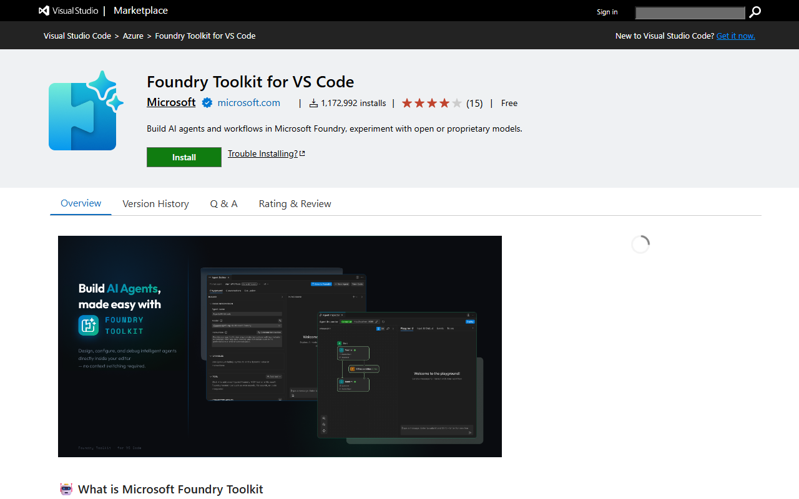
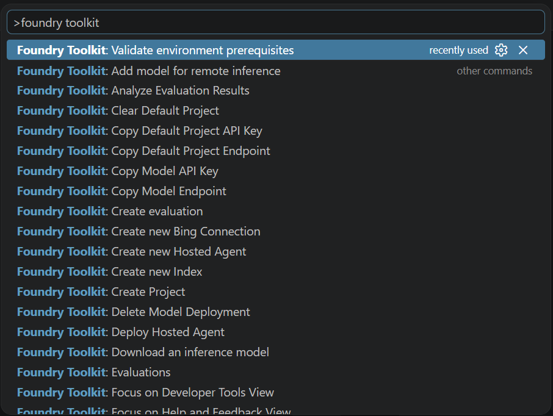

# 03. Foundry Toolkit for VS Code

**Estimated time:** 15 minutes

> [!TIP]
> Tick the checkbox next to each step as you complete it to track your progress through this module.

The **Foundry Toolkit for VS Code** extension brings Microsoft Foundry directly into your editor — no browser switching required. From the Activity Bar you can browse deployed models, open a live playground, create agents, inspect tool catalogs, and generate production-ready code without leaving VS Code.

> **Reference:** [Work with the Microsoft Foundry Toolkit for Visual Studio Code extension](https://learn.microsoft.com/en-us/azure/foundry/how-to/develop/get-started-projects-vs-code)
>
> **Tip:** In Module 04 you will create your first Prompt Agent using the Agent Builder experience directly inside this extension. This module focuses on getting the extension set up and oriented.

## Objectives

- Confirm the Foundry Toolkit extension is installed and signed in.
- Connect the toolkit to the Foundry project assigned to you.
- Tour the three main sections of the toolkit: **My Resources**, **Developer Tools**, and **Help and Feedback**.
- Open the Model Catalog, identify your deployed models, and start a playground session.
- Generate starter code for a deployed model.

## Steps

### 1. Verify the extension is installed

The Foundry Toolkit extension (`ms-windows-ai-studio.windows-ai-studio`) is pre-installed in the workshop devcontainer. If you are working locally, install it first.

- [ ] Open the **Extensions** view (<kbd>Ctrl</kbd>+<kbd>Shift</kbd>+<kbd>X</kbd>).
- [ ] Search for **Foundry Toolkit** and confirm the extension published by **Microsoft** is installed and enabled.

  <details>
  <summary>📸 Screenshot: Foundry Toolkit on the Visual Studio Marketplace</summary>

  

  </details>

  > **Note:** The extension was previously called **AI Toolkit**. If you see that name, update to the latest version.

- [ ] Confirm the **Foundry Toolkit icon** (the blue Foundry spark logo) appears in the **Activity Bar** on the left side of VS Code.

### 2. Sign in to Azure

The extension uses your Azure identity to access Foundry resources. Sign in through the Azure extension first.

- [ ] Press <kbd>Ctrl</kbd>+<kbd>Shift</kbd>+<kbd>A</kbd> to open the **Azure** view, or click the Azure icon in the Activity Bar.
- [ ] If the account panel shows **Sign in to Azure…**, click it and complete the browser-based sign-in with your workshop account.
- [ ] Confirm your subscription appears under **RESOURCES** in the Azure view.

  > **Tip:** You can also open a terminal and run `az login` if browser sign-in is unavailable in your environment.

### 3. Connect to your Foundry project

With the Azure identity confirmed, link the Foundry Toolkit to your assigned project.

- [ ] Click the **Foundry Toolkit** icon in the Activity Bar.
- [ ] In the **My Resources** section, expand **Microsoft Foundry Resources** and click **Set Default Project**.
- [ ] A quick-pick dropdown lists all Foundry projects in your subscription.
- [ ] Select the project assigned to you (for example, **lab-attendee-1**).

  Your project name is shown in the `FOUNDRY_PROJECT_NAME` value. You can verify it by running:

  ```bash
  azd env get-values | grep FOUNDRY_PROJECT_NAME
  ```

- [ ] Confirm the toolkit now shows your project name under **My Resources**, with sub-sections for **Models**, **Prompt Agents**, **Hosted Agents (Preview)**, **Tools**, **Knowledge**, and **Evaluations**.

  <details>
  <summary>📸 Screenshot: Foundry Toolkit My Resources panel</summary>

  

  </details>

  > **Tip:** Right-click on your project name to access the **Project Endpoint** and **API Key** — both are already saved in your `.env` file.

### 4. Tour the extension interface

The Foundry Toolkit sidebar has three collapsible sections.

<details>
<summary>📸 Screenshot: Foundry Toolkit sidebar sections</summary>


</details>

| Section | What it contains |
|---|---|
| **My Resources** | Deployed models, prompt agents, hosted agents, connections, and vector stores for your connected Foundry project |
| **Developer Tools** | Model Catalog, Model Playground, Agent Builder, Agent Playgrounds (remote and local), Tool Catalog, and Deploy Hosted Agents |
| **Help and Feedback** | Documentation links, GitHub repository, privacy statement, and community channels |

- [ ] Expand **My Resources** and note your project name. Expand it to see the sub-sections: **Models**, **Prompt Agents**, **Hosted Agents**, **Connections**, and **Knowledge Stores**.
- [ ] Expand **Developer Tools** to see the **Discover** and **Build** groups.
- [ ] Take a moment to scan the links under **Help and Feedback** — the documentation link opens the [Foundry Toolkit docs on `aka.ms/foundrytk/docs`](https://aka.ms/foundrytk/docs).

  > **Tip:** Press <kbd>F1</kbd> and type **Foundry Toolkit** to see all available commands from the command palette.

  <details>
  <summary>📸 Screenshot: VS Code command palette with Foundry Toolkit commands</summary>

  

  </details>

### 5. Explore My Resources — deployed models

- [ ] Under **My Resources**, expand your project, then expand **Models**.
- [ ] You should see a model deployment called `chat` and one called `embedding` that were deployed when the workshop environment was provisioned. The names of the deployment does not have to match the model name. So the specific model that is deployed as `chat` and `embedding` is up to your lab organizer.
- [ ] Click on the `chat` model entry to open the **model card**. Review:
  - **Deployment info**: name, provisioning state, deployment type, and rate limit.
  - **Endpoint info**: target URI and authentication type.
  - **Useful links**: code sample repository and tutorial links.

  > **Note:** The endpoint URI and key are already stored in your `.env` file — you don't need to copy them now.

### 6. Explore Developer Tools — Model Catalog

The Model Catalog lets you browse all models available across providers, not just the ones already deployed.

- [ ] Under **Developer Tools**, expand **Discover** and double-click **Model Catalog**.
- [ ] The Model Catalog page opens in the editor area.

  <details>
  <summary>📸 Screenshot: Foundry Toolkit model catalog</summary>

  

  </details>

- [ ] Use the filter dropdowns to explore:
  - **Hosted by**: Microsoft Foundry, GitHub, Foundry Local, OpenAI, Anthropic, and more.
  - **Publisher**: Microsoft, Meta, Mistral AI, DeepSeek, and others.
  - **Feature**: Text Attachment, Image Attachment, Web Search, Structured Outputs.
  - **Model type**: Remote or local (CPU / GPU / NPU).
- [ ] Use the search bar at the top to find a specific model by name.
- [ ] Click any model card to view its full description, context window, and supported inference tasks.

  > **Note:** You do not need to deploy any additional models — the `chat` and `embedding` models are already available for this workshop.

### 7. Explore Developer Tools — Tool Catalog

The Tool Catalog is where you browse and connect MCP servers and built-in tools to your agents. You will use this more in Module 06 (MCP Tools).

- [ ] Under **Developer Tools**, expand **Discover** and double-click **Tool Catalog**.
- [ ] Browse the available tools and MCP servers listed.

### 8. Open the Model Playground

Test a deployed model directly in VS Code without writing any code.

- [ ] Under **Developer Tools**, double-click **Model Playground**.
- [ ] In the **BASIC INFORMATION** panel, confirm **chat (via Microsoft Foundry)** is selected in the model dropdown.
- [ ] Click into the **System prompt** field and enter the following retail assistant prompt:

  ```text
  You are a helpful retail assistant for Contoso Outdoors, a company that sells
  outdoor sporting goods and equipment. You help customers with product inquiries,
  order status, return policies, and general shopping assistance. Always be
  friendly, concise, and direct customers to relevant products where appropriate.
  If you don't know something, say so honestly.
  ```

- [ ] In the chat area, type the following question and press <kbd>Ctrl</kbd>+<kbd>Enter</kbd> to send:

  ```text
  What's your return policy for hiking boots, and do you have any waterproof options available?
  ```

- [ ] Review the model's response — it should answer in the role of a Contoso Outdoors retail assistant.

  <details>
  <summary>📸 Screenshot: Model Playground response</summary>

  

  </details>

- [ ] Select **View Code** (top right of the playground) to see the SDK code that reproduces this call.

  > **Tip:** Select **History** (top left of the playground) to review your previous playground sessions.

### 9. Generate starter code for a model

Foundry Toolkit can generate a ready-to-run Python (or TypeScript) file that calls any deployed model.

- [ ] In **My Resources > Models**, right-click the `chat` model and select **Open code file**.
- [ ] Choose:
  - **SDK**: Azure AI Foundry SDK (or Azure OpenAI SDK)
  - **Language**: Python
  - **Authentication**: DefaultAzureCredential
- [ ] A new file opens in the editor with a working code sample.

  <details>
  <summary>📸 Screenshot: Generated Python sample code</summary>

  

  </details>

- [ ] Read through the generated code and note:
  - The project endpoint is pulled from your environment variable.
  - Authentication uses `DefaultAzureCredential` — no hard-coded keys.
  - The code is ready to run after installing `azure-ai-projects`.

## Validation

- [ ] The **Foundry Toolkit** icon appears in the Activity Bar.
- [ ] The toolkit **My Resources** section shows your assigned project name with **Models**, **Prompt Agents**, **Hosted Agents**, **Tools**, **Knowledge**, and **Evaluations** visible.
- [ ] The **Models** sub-section lists at least the `chat` and `embedding` deployments.
- [ ] You can open the **Model Playground**, set a system prompt, send a user message, and receive a response in the role of the retail assistant.
- [ ] The **View Code** button in the playground generates a Python code snippet.

## Troubleshooting

| Symptom | Fix |
|---|---|
| Extension icon missing after installation | Restart VS Code and confirm the extension is enabled in the Extensions view. |
| Sign-in fails or subscriptions do not load | Verify your workshop account has the correct role on the Foundry project. Try signing out and back in from the Azure extension. Run `az login` in the terminal as a fallback. |
| Project not listed under My Resources | Confirm `FOUNDRY_PROJECT_NAME` with `azd env get-values`. Ensure you selected the correct subscription and resource group. |
| Models do not appear | Confirm provisioning completed (`azd provision` finished without errors) and that your account has the **Azure AI Developer** role on the project. |
| Model Playground shows a quota or rate-limit error | Wait a few seconds and retry. The workshop environment has shared quota limits. |
