# 05. Agent tools and evaluations

**Estimated time:** 30 minutes

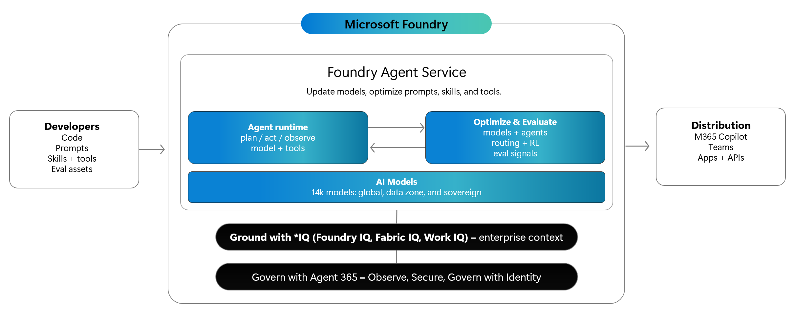

> [!TIP]
> Tick the checkbox next to each step as you complete it to track your progress through this module.

## Objectives

- Add the **Code Interpreter** tool to the `acl-remedy-advisor` agent.
- Update the agent instructions to guide the model on when to use each tool.
- Save the updated agent as **v2** and test it in the playground.
- Scaffold evaluation code using the Foundry Toolkit and explore the generated files.

## Concepts

### Built-in tools

A **tool** is a capability the agent can call during its reasoning loop. Foundry Agent Service provides three categories of tools:

| Category | Tool | What it does |
|---|---|---|
| Foundry Tools | **Web search** | Searches the internet and returns cited results; ideal for grounding responses in current information |
| Foundry Tools | **Code Interpreter** | Writes and runs Python in a sandboxed container; ideal for calculations, data comparisons, and charts |
| Foundry Tools | **File Search** | Searches uploaded documents using vector embeddings; ideal for grounding in private knowledge |
| Configured | **Grounding with Bing Search** | Enterprise-grade Bing search, requires a Bing connection in your Foundry project |
| Configured | **Azure AI Search** | Searches an existing Azure AI Search index; requires a connected search resource |

The **Configured** tab in the tool dialog shows only tools that are pre-authorised for your Foundry project. This means your agent never touches resources it has not been granted access to — keeping data inside Foundry's compliance boundary.

### How the agent chooses a tool

The model decides which tool to invoke based on two inputs:

1. **The user's message** — what the user is asking for in that turn.
1. **The agent's instructions** — guidance you provide about when each tool should be used.

If your instructions say "use code interpreter to perform calculations", the model will follow that guidance when it encounters a numeric question. Without explicit instructions the model still makes reasonable choices, but precise instructions produce consistent, predictable behaviour — which in turn makes evaluations more reliable.

### Evaluations

An **evaluation** runs your agent against a dataset of test inputs and scores each response using one or more **evaluators**. This gives you quantitative, reproducible feedback on agent quality — something you cannot get from manual playground testing alone.

The Foundry Toolkit can scaffold the evaluation code for you using the `pytest-agent-evals` framework. The scaffold generates:

| File | Purpose |
|---|---|
| `test_<agent-name>.py` | pytest test file; each row in `data.jsonl` becomes one test case |
| `data.jsonl` | Sample test inputs for your agent |
| `evaluators.py` | Evaluator configuration wired to your Azure OpenAI endpoint |
| `requirements.txt` | Python dependencies for the evaluation suite |
| `pytest.ini` | pytest configuration |
| `README.md` | Instructions for running the evaluation locally |

The built-in evaluators relevant to an agent with tools are:

| Evaluator | Category | What it measures |
|---|---|---|
| **Tool Call Accuracy** | Agents | Whether the agent called the right tool with the right arguments |
| **Task Adherence** | Agents | Whether the agent's final response fully satisfies the user's request |
| **Intent Resolution** | Agents | Whether the agent's initial actions correctly matched the user's intent |
| **Relevance** | RAG | How relevant the response is to the query |
| **Coherence** | General | Whether the response is logically coherent and well-structured |

## Steps

### Part 1 — Add Code Interpreter to the agent

#### 1. Open the agent in Agent Builder

- [ ] Click the **Foundry Toolkit** icon in the Activity Bar to open the **MY RESOURCES** panel.
- [ ] Expand **Prompt Agents** → **acl-remedy-advisor** and confirm you can see **v1** listed below the agent.
- [ ] Click **v1** to open Agent Builder, or click **acl-remedy-advisor** and then **v1** if needed.
- [ ] Confirm the Agent Builder header shows `acl-remedy-advisor | Microsoft Foundry | v1`.

#### 2. Open the tool picker

- [ ] Scroll down in the left panel to the **TOOL** section. You should see **Web search** already listed from Module 04.
- [ ] Click the **+** button next to **TOOL** to open the *Select a tool* dialog.
- [ ] Confirm the **Configured** tab is selected. This tab shows tools that are pre-authorised for your Foundry project.

  

  The dialog shows five Foundry Tools. **Web search** already shows an **Added** badge — you configured it in Module 04. **Code Interpreter** and **File Search** are available but not yet added.

#### 3. Add Code Interpreter

- [ ] Click **Code Interpreter** to select it. The card highlights when selected.
- [ ] Click **Add Tools (1)** at the bottom right of the dialog.
- [ ] Confirm **Code Interpreter** now appears in the **TOOL** section below **Web search**.

  

  Both tools are now active. The agent's reasoning loop will have access to both during every conversation turn.

### Part 2 — Update the instructions

With two tools available, the agent needs guidance on *when* to use each one. Without it, the model may not call Code Interpreter for calculation questions — or may call it unnecessarily. Good instructions make tool selection predictable and consistent.

#### 4. Add a Code Interpreter instruction

- [ ] Scroll back up to the **Instructions** field.
- [ ] Position your cursor at the end of the existing instructions (after the last line).
- [ ] Press **Enter** twice to create a blank line, then add this paragraph:

  ```text
  When asked to calculate refund amounts, depreciation, pro-rata warranty
  values, or compare prices, use code interpreter to perform the calculation
  precisely and show your working.
  ```

- [ ] Confirm the new paragraph appears at the bottom of the instructions box.

  > The instruction is deliberately specific: it tells the agent *what* to calculate with Code Interpreter (refund amounts, depreciation, pro-rata values, price comparisons) rather than just saying "use Code Interpreter for calculations". Specificity reduces ambiguity and makes the agent's behaviour more predictable.

### Part 3 — Save and test the updated agent

#### 5. Save as version 2

- [ ] Click **Save to Foundry** in the top-right of Agent Builder.
- [ ] Wait for the confirmation notification: *Agent 'acl-remedy-advisor' updated successfully.*
- [ ] Confirm the Agent Builder header now shows `acl-remedy-advisor | Microsoft Foundry | v2`.
- [ ] Check the **MY RESOURCES** panel — **v2** should appear below `acl-remedy-advisor`, alongside **v1**.

  

  Foundry Agent Service stores an immutable snapshot of the agent configuration as **v2**. Your Module 04 code still works unchanged — it references the agent by name and will automatically use the latest version (v2) from this point forward.

#### 6. Test in the playground

- [ ] Click the **Playground** tab at the top of Agent Builder.
- [ ] Send the following message to test both tools:

  > A customer bought a $899 laptop 14 months ago. The battery now only holds 20% of its original capacity after normal use. The manufacturer's warranty was 12 months. What are the customer's rights under Australian Consumer Law, and what would a reasonable refund amount be if they've had 14 months of use from a product expected to last at least 3 years?

- [ ] Review the response. Confirm the agent:
  - Classifies the failure as major or minor under ACL.
  - Explains the remedy options available to the customer.
  - Uses Web search to cite current ACCC guidance.

  

  > **Note:** The test prompt is designed to trigger Web search (for ACL guidance) but may not always trigger Code Interpreter for the refund calculation — the model exercises judgement. In a real scenario you would iterate on both the prompt and the instructions until Code Interpreter fires reliably for calculation requests.

### Part 4 — Scaffold evaluation code

Manually testing one prompt in the playground is useful for quick checks, but it does not give you reproducible, measurable quality scores. Evaluations fill that gap — they run your agent against a dataset and score every response automatically.

The Foundry Toolkit can generate the evaluation scaffolding for you so you can get started without writing boilerplate.

#### 7. Open the Evaluation tab

- [ ] Click the **Evaluation** tab in the Agent Builder header (next to Playground and Conversations).
- [ ] The **Evaluation Setup** screen appears with two options:

  

  - **Scaffold Evaluation Code** — generates a `pytest-agent-evals` test suite in your local workspace. Use this to run evaluations locally or in CI/CD.
  - **Go to Foundry** — opens the Foundry portal where you can run evaluations directly in the cloud without any local setup.

  You will use the local scaffold option in this module.

#### 8. Choose your evaluators

- [ ] Click **Scaffold Evaluation Code**.
- [ ] The **Select Evaluator(s)** dialog opens, listing all available evaluators grouped by category.

  

- [ ] In the **Agents** category, check **Tool Call Accuracy**.

  > **Tool Call Accuracy** evaluates whether the agent called the right tools and passed them the right arguments. It is important for this agent because the instructions tell the model *when* to call Code Interpreter — Tool Call Accuracy verifies the model is following those instructions.

- [ ] Also check **Task Adherence**.

  > **Task Adherence** evaluates whether the agent's final response actually satisfies what the user asked for. A response can invoke a tool correctly but still fail to give the user a useful answer — Task Adherence catches that.

  

- [ ] Click **OK**.

#### 9. Select the save folder

- [ ] A folder picker dialog appears: *Select a folder to save the evaluation code*.
- [ ] Navigate to (or type):

  ```text
  labs/introduction-foundry-agent-service/05-agent-tools-and-evaluations/src
  ```

- [ ] Click **Select Folder**.

#### 10. Explore the generated files

The Foundry Toolkit generates the following files in `src/`:

| File | Purpose |
|---|---|
| `test_acl_remedy_advisor.py` | pytest test file; each row in `data.jsonl` becomes one test case |
| `data.jsonl` | Sample test inputs and expected tool calls |
| `evaluators.py` | Evaluator configuration wired to your Azure OpenAI endpoint |
| `requirements.txt` | Python dependencies (`pytest-agent-evals`, `python-dotenv`) |
| `pytest.ini` | pytest settings for the evaluation suite |
| `README.md` | Instructions for running the evaluation locally |

- [ ] Open `test_acl_remedy_advisor.py`. Notice the imports at the top:

  ```python
  from pytest_agent_evals import (
      EvaluatorResults,
      evals,
      AzureOpenAIModelConfig,
      FoundryAgentConfig,
      BuiltInEvaluatorConfig,
      CustomPromptEvaluatorConfig,
      CustomCodeEvaluatorConfig
  )
  ```

  The `pytest_agent_evals` package wraps the Azure AI evaluation SDK with a pytest-compatible interface. Each test case loads from `data.jsonl`, runs your agent, and scores the response against the configured evaluators.

- [ ] Open `data.jsonl` to see the sample test inputs. Each line is a JSON object with a `query` field (what the user sends) and optional `expected_tool_calls` metadata (what tools should fire).
- [ ] Open `evaluators.py` to see how the Tool Call Accuracy and Task Adherence evaluators are wired to your Azure OpenAI deployment.

  > The evaluation code uses your `AZURE_OPENAI_ENDPOINT` and `AZURE_OPENAI_DEPLOYMENT_NAME` environment variables as the **judge model** — a separate model instance that scores the responses produced by your agent. A stronger judge model generally produces more reliable scores.

### Part 5 — Run an automatic evaluation in the Foundry portal

The local scaffold from Part 4 runs evaluations on your machine. The Foundry portal provides a no-code alternative: it generates test data, runs your agent, and scores responses — all in the cloud, with no Python required.

#### 11. Open the Evaluation tab in the portal

- [ ] Open the [Microsoft Foundry portal](https://ai.azure.com) and navigate to your project.
- [ ] In the left navigation, click **Agents**.
- [ ] Click **acl-remedy-advisor** to open the agent detail view.
- [ ] Click the **Evaluation** tab at the top of the agent detail page.
- [ ] Confirm the **Automatic Evaluation** sub-tab is selected and shows *No evaluations found*.

  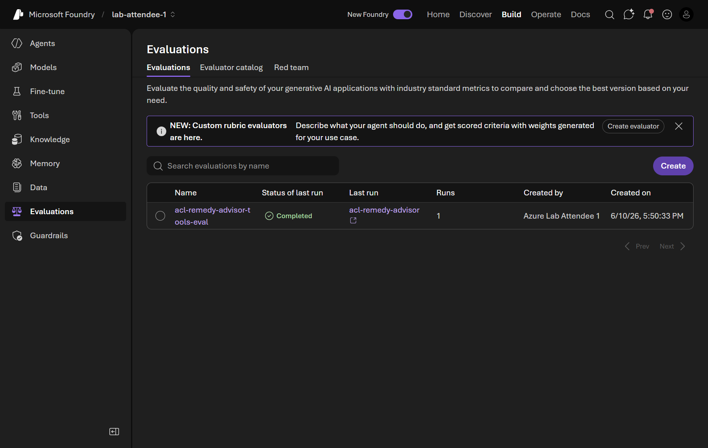

- [ ] Click **Create** (top-right of the evaluations list).

#### 12. Step 1 — Select the evaluation target

- [ ] The **Create new evaluation** wizard opens at **Step 1: Target**.
- [ ] Confirm **Agent** is already selected. `acl-remedy-advisor v2` is pre-checked in the agent list on the right.

  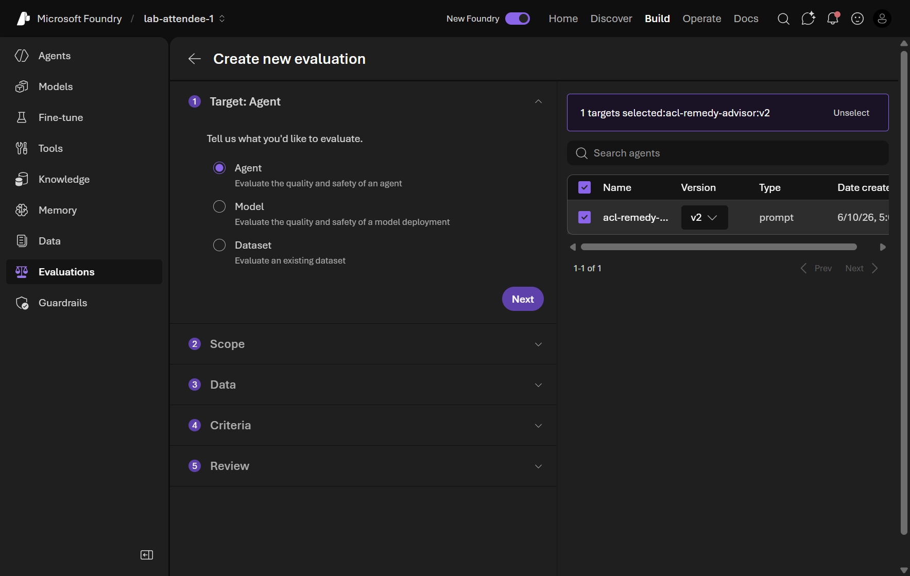

- [ ] Click **Next**.

#### 13. Step 2 — Select the evaluation scope

- [ ] **Step 2: Scope** offers two options:
  - **Individual turns** — evaluates single query–response pairs. Best for testing tool selection and per-turn response quality.
  - **Full conversations** (preview) — evaluates complete multi-turn conversations end-to-end.

  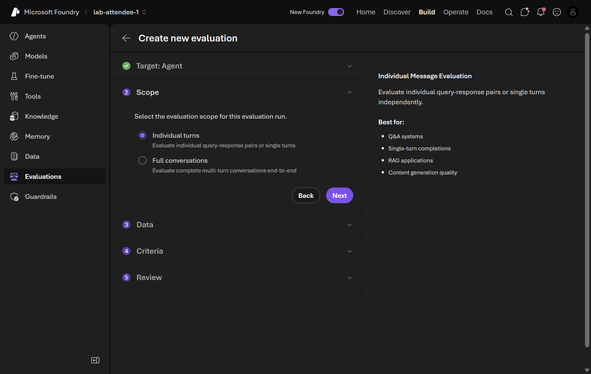

- [ ] Keep **Individual turns** selected — it gives you per-turn tool accuracy scores which align with the evaluators you selected in Part 4.
- [ ] Click **Next**.

#### 14. Step 3 — Choose a data source

- [ ] **Step 3: Data** offers four sources:
  - **Synthetic generation** — the portal auto-generates test questions using a model and a prompt you provide.
  - **Existing dataset** — upload your own JSONL or CSV file.
  - **Benchmarks** — industry-standard benchmarks with built-in evaluators.
  - **Existing traces** — evaluate real conversations already logged by the agent.

  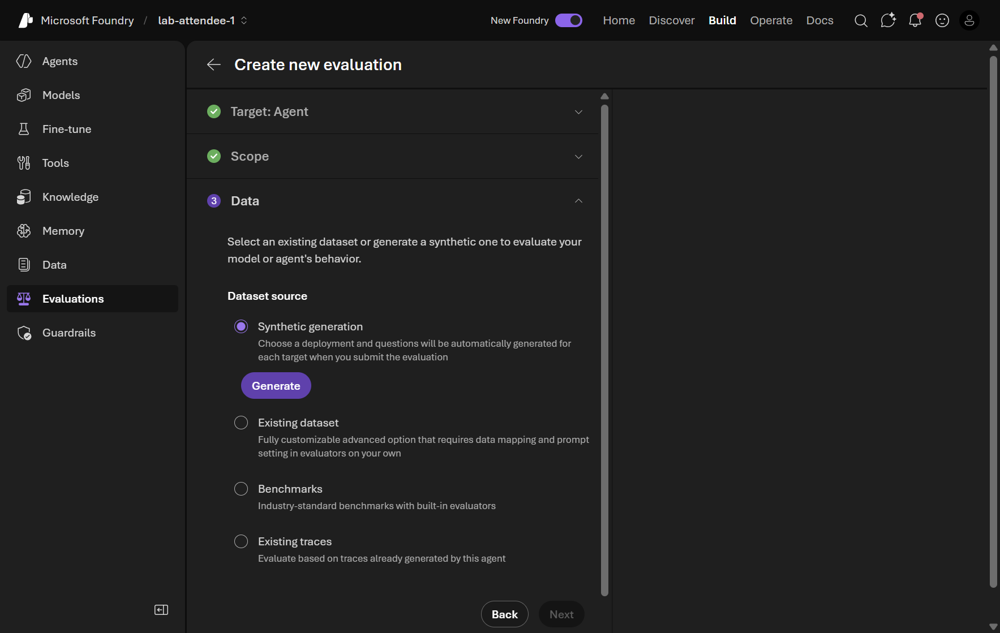

- [ ] Keep **Synthetic generation** selected — this is the zero-effort path; the portal generates relevant test questions automatically.
- [ ] Click **Generate** to open the dataset configuration dialog.
- [ ] In the **Generate synthetic dataset** dialog:
  - Leave the dataset name as generated.
  - Confirm **Model** is set to `chat` (or your project's chat deployment).
  - Change **Number of rows** to **5** — enough to demonstrate the evaluation without consuming significant quota.
  - In the **Prompt** field, describe what test questions to generate:

    ```text
    Generate questions a retail staff member might ask about Australian
    Consumer Law remedies for common product faults: faulty electronics,
    broken appliances, defective clothing, and expired warranties. Include
    at least one question requiring a refund calculation.
    ```

  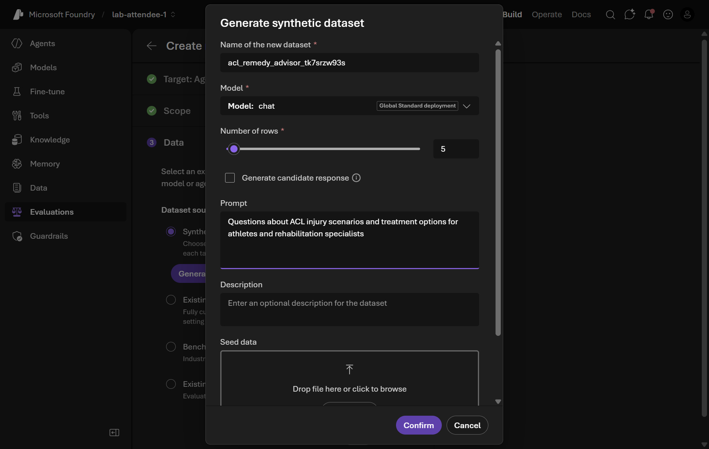

- [ ] Click **Confirm**. The dataset card appears under Synthetic generation showing the name and *Version 1.0*.

  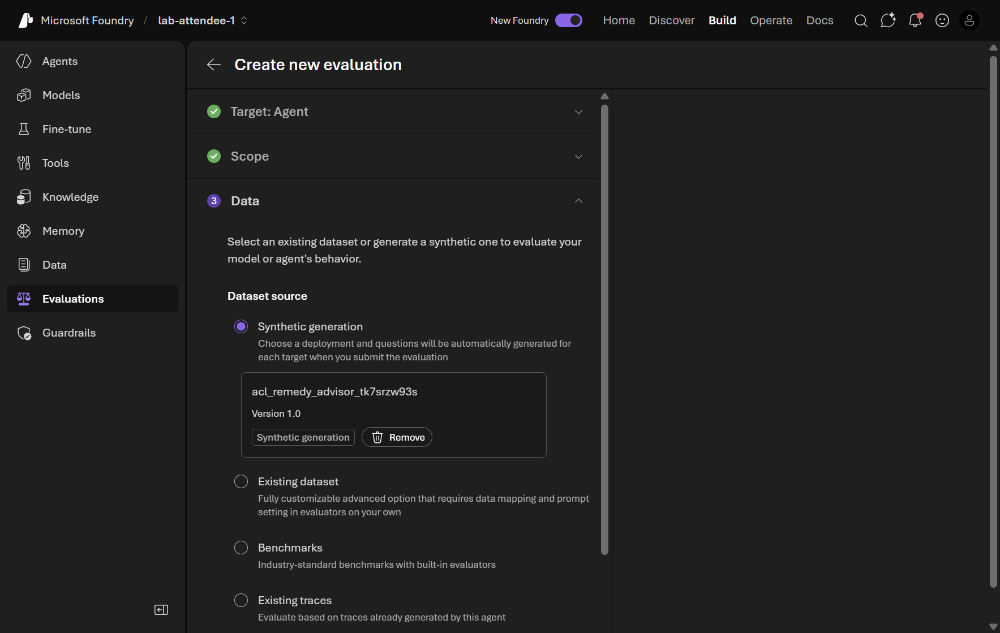

- [ ] Click **Next**.

#### 15. Step 4 — Review the auto-suggested criteria

- [ ] **Step 4: Criteria** automatically pre-selects evaluators based on your target and scope. For an Agent evaluated at Individual turns scope, the portal suggests:
  - **Agents (9)**: ToolSelection, ToolOutputUtilization, ToolInputAccuracy, ToolCallSuccessEvaluator, TaskCompletion, TaskAdherence, IntentResolution, CustomerSatisfaction, ToolCallAccuracy
  - **Quality (4)**: Groundedness, Fluency, Coherence, Relevance
  - **Safety (6)**: Violence, SelfHarm, IndirectAttack, Sexual, HateAndUnfairness, CodeVulnerability

  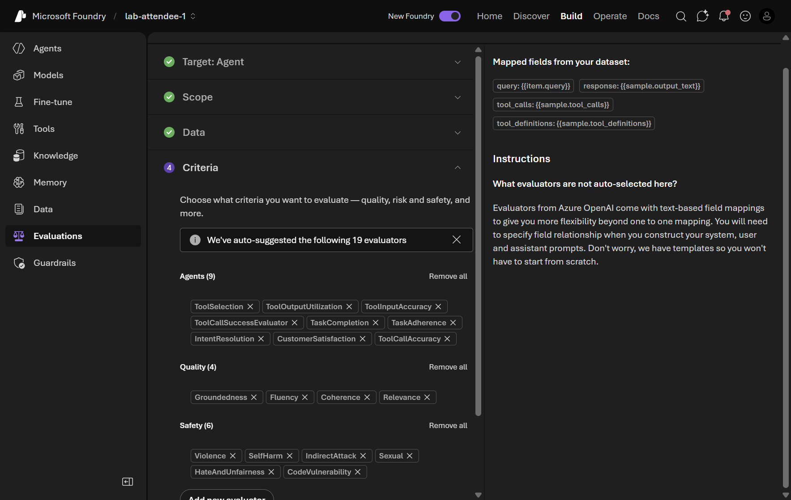

  > The portal automatically maps your dataset fields to the evaluator inputs and shows the field bindings in the right panel (`query: {{item.query}}`, `response: {{sample.output_text}}`, etc.). You do not need to configure field mapping manually for synthetic data.

- [ ] Leave all 19 evaluators selected — the breadth shows how the portal covers quality, tool usage, and safety in a single run.
- [ ] Click **Next**.

#### 16. Step 5 — Name and submit the evaluation

- [ ] **Step 5: Review** shows a full summary on the right: Target, Scope, Dataset, and all selected Evaluators.
- [ ] Replace the auto-generated evaluation name with something descriptive, for example:

  ```text
  acl-remedy-advisor-tools-eval
  ```

  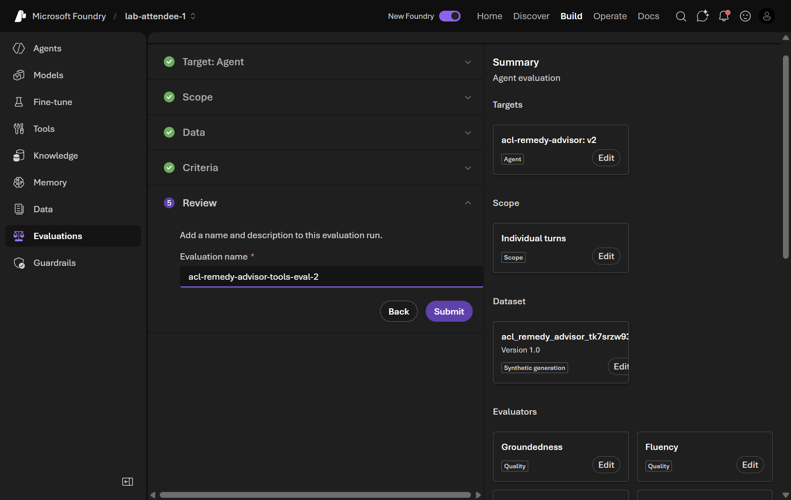

- [ ] Click **Submit**.

#### 17. Monitor the evaluation run

- [ ] After submitting, the portal navigates to the **acl-remedy-advisor-tools-eval** evaluation detail page.
- [ ] Under **Evaluation runs**, you will see a row for your run. Wait for the **Status** to change to **Completed** (typically a few minutes for 5 rows).

  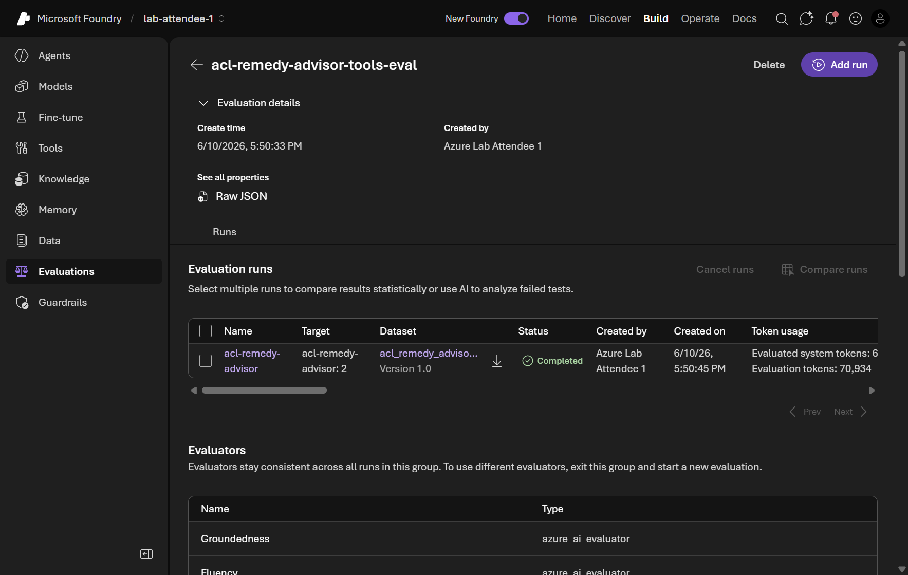

- [ ] Click the run name to open the detailed results view.
- [ ] In the results view, observe the per-evaluator scores for each test row.

  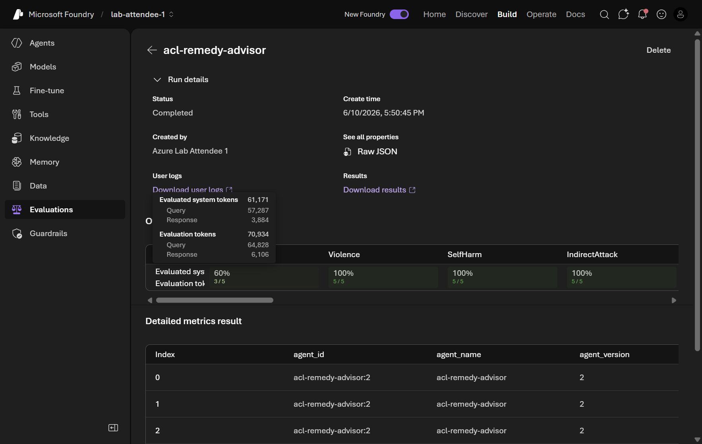

- [ ] Look for:
  - **ToolCallAccuracy** and **TaskAdherence** — are the scores consistently above 3 out of 5?
  - Any **Safety** evaluators flagging content?
  - Any rows where **Groundedness** is low — indicating the response is not grounded in web-sourced facts?

  > Evaluation results give you a quantitative baseline you can compare across agent versions. After improving the instructions or adding tools, run the same evaluation again and compare the scores — a higher ToolCallAccuracy score means the agent is following your tool-usage instructions more reliably.

## Validation

- The Agent Builder header shows `acl-remedy-advisor | Microsoft Foundry | v2` after saving.
- **Code Interpreter** appears in the **TOOL** section of Agent Builder alongside **Web search**.
- **v2** appears under `acl-remedy-advisor` in the **MY RESOURCES** panel.
- The playground response for the laptop battery prompt classifies the failure under ACL and provides remedy options.
- The evaluation scaffold generates these files in `src/`: `test_acl_remedy_advisor.py`, `data.jsonl`, `evaluators.py`, `requirements.txt`, `pytest.ini`, `README.md`.
- The Foundry portal shows an `acl-remedy-advisor-tools-eval` evaluation with a **Completed** status and per-evaluator scores.

## Troubleshooting

- **Code Interpreter does not appear after adding** — close and reopen Agent Builder. If the tool still does not appear, refresh the Foundry Toolkit sidebar by clicking the refresh icon next to **MY RESOURCES**.
- **Save to Foundry fails with "Cannot read properties of undefined"** — this is a transient error. Click **Save to Foundry** again. If it continues to fail, check your network connection and confirm your Default Project is still set correctly in the Foundry Toolkit.
- **Scaffold Evaluation Code generates no files** — confirm you selected a folder that exists and that VS Code has write permission to it. If the dialog closes without generating files, check the VS Code **Output** panel (select **Foundry Toolkit** in the dropdown) for error details.
- **Code Interpreter does not fire in the playground** — the model exercises judgement about when to use tools. Rephrase your prompt to make the calculation need explicit, for example: *Calculate the pro-rata refund for a $899 laptop used for 14 out of 36 expected months.* You can also strengthen the Code Interpreter instruction to be more specific about the trigger conditions.
- **Web search does not fire** — rephrase your prompt to explicitly request current information, for example: *Search accc.gov.au for the current rules on battery degradation under ACL consumer guarantees.*
- **Evaluation stays In progress** — the synthetic data generation and agent runs consume model quota. If the evaluation does not complete within 10 minutes, check the Azure portal for quota alerts on your chat deployment. Reduce the number of rows or switch to a faster model as the judge.
- **Low ToolCallAccuracy scores** — review the agent's instructions for Code Interpreter. Add specificity: name the exact types of calculation (refund amounts, depreciation, pro-rata values) and ensure the instruction ends with "show your working" to encourage Code Interpreter usage.
