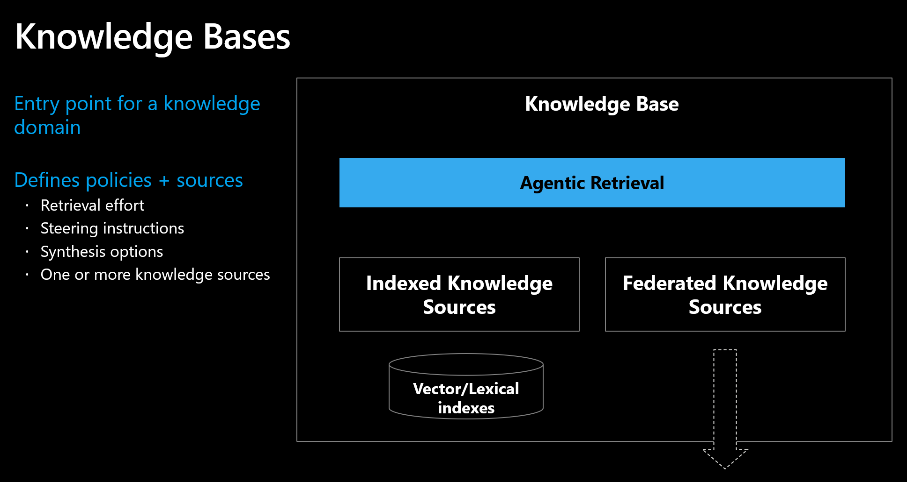

# 07. Ground the agent with Foundry IQ knowledge bases

**Estimated time:** 25 minutes



> [!IMPORTANT]
> Creating a Foundry IQ knowledge base requires the **`foundry-project-manager`** role or higher. If you were assigned the `foundry-user` role, ask your organizer to elevate it before proceeding. Organizers: ensure `AZURE_ATTENDEE_DEFAULT_ROLE=foundry-project-manager` (the recommended default).

<!-- markdownlint-disable-next-line MD028 -->
> [!IMPORTANT]
> This module builds on [Module 06 — Integrate MCP tools](../06-mcp-tools/README.md). After Module 06 the `acl-remedy-advisor` agent is at **v3** with three direct tools — **Web search**, **Code Interpreter**, and the **MCP** server.

<!-- markdownlint-disable-next-line MD028 -->
> [!NOTE]
> If you could not complete the earlier modules, recreate the agent from code before continuing. The Module 06 solution script restores the v3 three-tool agent, which is a valid starting point for this module:
>
> ```bash
> python labs/introduction-foundry-agent-service/06-mcp-tools/solution/create_agent_with_mcp.py
> ```

<!-- markdownlint-disable-next-line MD028 -->
> [!TIP]
> Tick the checkbox next to each step as you complete it to track your progress through this module.

## Objectives

- Understand how **Foundry IQ** turns Azure AI Search indexes into a grounding layer for agents.
- Verify that the pre-seeded `retail-products` and `retail-policies` indexes exist and are populated.
- Create a **Foundry IQ knowledge base** that combines both indexes as knowledge sources.
- Attach the knowledge base to the `acl-remedy-advisor` agent through the Foundry portal.
- Update the agent instructions so it routes between the knowledge base, the `retail-remedy-ops` tools, web search, and Code Interpreter.
- Test the agent with queries that require accurate product and policy knowledge.

## Concepts

### What is Foundry IQ?

**Foundry IQ** is the knowledge layer in Microsoft Foundry. It lets you combine multiple Azure AI Search indexes behind a single, agent-ready retrieval endpoint called a **knowledge base**. Instead of wiring one Azure AI Search index at a time, you create a knowledge base that holds multiple **knowledge sources** and exposes them to agents through a single connection.

When an agent has a knowledge base attached and the user asks a question, Foundry IQ runs retrieval across all configured knowledge sources, re-ranks the results, and injects the most relevant passages into the model's context. The agent's response is then grounded in your enterprise data — not just in model training knowledge.

### Knowledge sources

A **knowledge source** is a single Azure AI Search index registered inside a knowledge base. Each source has a **name**, an optional **description**, and a reference to the **search index** it reads from. You do **not** map individual fields by hand — Foundry IQ reads the index's **semantic configuration** to determine which fields supply content, titles, and keywords automatically.

Both workshop indexes were seeded with a semantic configuration and pre-computed 1536-dimension embeddings, so Foundry IQ can run semantic and vector retrieval against them with no extra setup. When you add a knowledge source, the dialog notes that the *"Search index must contain semantic configuration"* — the workshop indexes already satisfy this requirement.

### Why not just use the Azure AI Search tool?

You could connect each index individually using the **Azure AI Search** tool in the agent's tool picker (as shown in Module 05's tool list). Foundry IQ knowledge bases offer three advantages over individual connections:

1. **Multi-source fusion** — a single knowledge base retrieves across both indexes in one call, re-ranking results from both before injecting context.
1. **Managed configuration** — retrieval behaviour (reasoning effort, output mode, and retrieval instructions) is configured once in the knowledge base and reused by any agent that attaches it.
1. **Consistent grounding** — the same retrieval behaviour applies everywhere the knowledge base is used, making evaluations reproducible.

## Prerequisites — the search indexes are already provisioned

This module uses two Azure AI Search indexes that the workshop provisioning scripts created and populated during setup. They live in the Azure AI Search service connected to your Foundry project (`aisrch-foundry-hol8`):

| Index | Default name | Environment variable | Contents | Key fields |
|---|---|---|---|---|
| Retail products | `retail-products` | `AZURE_SEARCH_PRODUCT_INDEX_NAME` | ~100 supermarket products | `id`, `title`, `content`, `category`, `tags`, `price`, `rating`, `contentVector` |
| Retail policies | `retail-policies` | `AZURE_SEARCH_DOCUMENT_INDEX_NAME` | ~50 store policies | `id`, `title`, `content`, `policyType`, `category`, `effectiveDate`, `contentVector` |

> [!NOTE]
> The **Indexes** tab on the Knowledge page lists only indexes created *inside* Foundry. The workshop indexes live in the connected Azure AI Search service, so they will **not** appear on that tab — this is expected. You select them directly by name when you add knowledge sources in Part 2. If you need to confirm they exist, view the indexes in the [Azure portal](https://portal.azure.com) under the AI Search resource, or ask your proctor. To recreate them if necessary:
>
> ```bash
> python scripts/seed-product-index.py
> python scripts/seed-document-index.py
> ```

<!-- markdownlint-disable-next-line MD028 -->
> [!NOTE]
> At query time the agent retrieves from the knowledge base as your Foundry **project's managed identity**, which needs the **Search Index Data Reader** role on the Azure AI Search service. The workshop infrastructure (`infra/main.bicep`) assigns this automatically. If grounded answers fail with an access error, see **Access denied (HTTP 403)** in Troubleshooting.

## Steps

### Part 1 — Create the knowledge base and add the first source

#### 1. Open the Knowledge page

- [ ] In the [Microsoft Foundry portal](https://ai.azure.com), navigate to your project.
- [ ] In the left navigation under **Build**, click **Knowledge**.
- [ ] Confirm the page heading reads **Knowledge (Foundry IQ)** and the **Knowledge bases** tab is selected.

  <details>
  <summary>📸 Screenshot: Knowledge (Foundry IQ) page — Knowledge bases tab</summary>

  

  </details>

#### 2. Choose the knowledge type

- [ ] Click **Create a knowledge base**. The **Choose a knowledge type** dialog opens, listing the available source types (Azure AI Search Index, Azure Blob Storage, Web, SharePoint, OneLake, Fabric IQ, Azure SQL, Work IQ, File, MCP Server).
- [ ] Select the **Azure AI Search Index** tile ("Enterprise scale search for app development").
- [ ] Click **Connect**.

  <details>
  <summary>📸 Screenshot: Choose a knowledge type — Azure AI Search Index</summary>

  

  </details>

  The **Create a new knowledge base** page opens (with **Save knowledge base** and **Cancel** in the top-right) and immediately shows the **Create a knowledge source** dialog.

#### 3. Create the retail-products knowledge source

- [ ] In the **Create a knowledge source** dialog, set the fields:
  - **Name**: replace the default (for example `ks-searchindex-69`) with:

    ```text
    retail-products
    ```

  - **Description** (optional):

    ```text
    Retail product catalog: specifications, compatibility, and feature details for store products.
    ```

  - **Select search index**: choose **retail-products** from the dropdown.

  > [!NOTE]
  > There is no field mapping step. Foundry IQ reads the index's **semantic configuration** to locate content, titles, and keywords. The dialog notes *"Search index must contain semantic configuration"* — the workshop indexes already include one.

  <details>
  <summary>📸 Screenshot: Create a knowledge source — retail-products</summary>

  

  </details>

- [ ] Click **Create**. The source appears in the knowledge base's **Knowledge sources** list.

  <details>
  <summary>📸 Screenshot: retail-products knowledge source configured</summary>

  

  </details>

---

### Part 2 — Add the retail-policies knowledge source

#### 4. Add the second source

- [ ] On the **Create a new knowledge base** page, open the **Add sources** dropdown and choose **Azure AI Search Index** again.
- [ ] In the **Create a knowledge source** dialog, set the fields:
  - **Name**:

    ```text
    retail-policies
    ```

  - **Description** (optional):

    ```text
    Store policies: returns, refunds, warranties, loyalty program, and store-brand guarantees.
    ```

  - **Select search index**: choose **retail-policies**.
- [ ] Click **Create**. Both `retail-products` and `retail-policies` now appear in the **Knowledge sources** list.

---

### Part 3 — Name and save the knowledge base

#### 5. Complete the basic configuration

- [ ] In the **Basic configuration** section, set:
  - **Name**: use your per-attendee knowledge base name from `KNOWLEDGE_BASE_NAME` (for example, `acl-remedy-knowledge-lab-attendee-1`).
  - **Description** (optional):

    ```text
    Retail product catalog and store policy knowledge for the ACL Remedy Advisor agent.
    ```

  - **Chat completions model**: leave as **Select model** (not required for extractive retrieval).
  - **Retrieval reasoning effort**: **Minimal**.
  - **Output mode**: **Extractive data**.
  - **Retrieval instructions** (optional): leave empty.
- [ ] Confirm the **Knowledge sources** table lists both `retail-products` and `retail-policies` as type **Azure AI Search Index** with status **Active**.

  <details>
  <summary>📸 Screenshot: Knowledge base basic configuration</summary>

  

  </details>

#### 6. Save the knowledge base

- [ ] Click **Save knowledge base** in the top-right.
- [ ] Wait for creation to complete. The knowledge base detail page opens (its heading is the knowledge base name) with **Save** and **Use in an agent** buttons in the top-right.

  <details>
  <summary>📸 Screenshot: Knowledge base created</summary>

  

  </details>

---

### Part 4 — Attach the knowledge base to the agent

#### 7. Use the knowledge base in an agent

- [ ] On the knowledge base detail page, click **Use in an agent** in the top-right.
- [ ] In the **Recent agents** dropdown, select **acl-remedy-advisor**. (Use **View all agents** if it is not listed.)

  <details>
  <summary>📸 Screenshot: Use in an agent — select acl-remedy-advisor</summary>

  

  </details>

#### 8. Confirm the Knowledge section

- [ ] You land on the **acl-remedy-advisor** agent's **Build** page.
- [ ] Scroll the configuration panel and confirm a **Knowledge** section now lists your knowledge base, separate from the **Tools** section (which still shows **Code interpreter**, **Web search**, and the `retail-remedy-ops` MCP server).

  > [!NOTE]
  > Attaching the knowledge base auto-saves the agent as a new version (for example, **Version 4**). You will save again after updating the instructions.

  <details>
  <summary>📸 Screenshot: Agent Build page — Knowledge section added</summary>

  

  </details>

---

### Part 5 — Update the agent instructions

The agent now has the knowledge base attached, but it needs guidance on *when* to use each capability. Without explicit routing instructions the model may answer from training knowledge, or never call the `retail-remedy-ops`, web search, or Code Interpreter tools.

#### 9. Add tool-routing and grounding instructions

- [ ] In the **Instructions** field, position your cursor at the end of the existing instructions.
- [ ] Press **Enter** twice, then add the following. These paragraphs cover the operational MCP tools, the knowledge base, web search, and Code Interpreter so the agent reaches for the right capability each time:

  ```text
  When a staff member provides a receipt ID, order ID, or customer ID — or asks
  you to look up a purchase, verify an order, or open a support case — use the
  retail-remedy-ops tools to perform that operational lookup or action. Never
  invent receipt, order, or case details; always retrieve them with the tools.

  When answering questions about specific products available in the store —
  including product names, descriptions, categories, prices, ratings, or stock
  availability — use the knowledge base to retrieve accurate product information
  and cite the source in your response.

  When answering questions about store policies — including return windows,
  refund eligibility, warranty coverage, loyalty program rules, or store-brand
  guarantees — use the knowledge base to retrieve the relevant policy and quote
  it directly.

  Prefer knowledge base retrieval over your training knowledge for all product
  and policy questions. The knowledge base reflects the store's current catalog
  and policies, not general retail conventions.

  To summarise tool routing: use the retail-remedy-ops tools for operational
  lookups and actions, the knowledge base for product and policy questions, web
  search for current ACCC and Australian Consumer Law guidance, and code
  interpreter for refund, depreciation, pro-rata, or price calculations.
  ```

  > [!NOTE]
  > Earlier modules already added guidance for **web search** (current ACCC guidance) and **Code Interpreter** (refund and depreciation calculations). The tool-routing summary above reinforces them so no tool is left unused.

  <details>
  <summary>📸 Screenshot: Updated agent instructions with tool routing</summary>

  

  </details>

#### 10. Save the agent

- [ ] Click **Save** in the top-right.
- [ ] Wait for the save to complete and confirm the agent advances to a new version (for example, **Version 5**).

---

### Part 6 — Test grounded retrieval

#### 11. Run a combined policy query

- [ ] Open the **Playground** (Chat) panel for the agent.
- [ ] Send the following message:

  > According to our store's return policy, how many days do customers have to return non-perishable items with a receipt, and within what timeframe should spoiled perishable items be reported?

- [ ] Review the response. Confirm the agent:
  - Answers **14 days** for non-perishable returns with a receipt and **48 hours** for reporting spoiled perishable items.
  - Includes numbered citations (for example `[1]` `[2]`) that link to `mcp://searchindex/...` sources.
  - Shows the knowledge base tool chip (for example `kb-...`) in the response trace.

  <details>
  <summary>📸 Screenshot: Playground — grounded policy response with citations</summary>

  

  </details>

  > [!TIP]
  > This query does not include a receipt or customer ID, so the agent grounds from the knowledge base and does **not** invoke the `retail-remedy-ops` MCP tools — exactly the routing behaviour the instructions describe.

#### 12. (Optional) Exercise the other tools

- [ ] **Product lookup (knowledge base):** *"Recommend a healthy breakfast cereal with nuts, and include its price and rating."* — expect a specific product from `retail-products` with a citation.
- [ ] **Operational lookup (retail-remedy-ops):** provide a receipt ID from Module 06 and ask the agent to look it up — expect an MCP tool call.
- [ ] **Consumer law guidance (web search):** *"What does the ACCC say about repair versus replacement for a major failure?"* — expect a web-search-grounded answer citing accc.gov.au.
- [ ] **Calculation (Code Interpreter):** *"A customer paid $480 for an appliance 18 months into a 36-month expected life. Calculate a pro-rata refund."* — expect a worked calculation.

## Validation

- [ ] **Knowledge base created**: Your knowledge base (the `KNOWLEDGE_BASE_NAME` value, for example `acl-remedy-knowledge-lab-attendee-1`) is listed on the **Knowledge bases** tab.
- [ ] **Two knowledge sources**: The knowledge base shows both `retail-products` and `retail-policies` as **Azure AI Search Index** sources with status **Active**.
- [ ] **Attached to agent**: The knowledge base appears in the `acl-remedy-advisor` agent's **Knowledge** section, and the agent has advanced to a new version.
- [ ] **Grounded policy answers**: Policy queries return answers with numbered citations to `mcp://searchindex/...` sources rather than generic retail conventions.
- [ ] **Grounded product answers**: Product queries return specific product names, prices, and ratings that match the `retail-products` index.
- [ ] **Tool routing intact**: Operational queries (with a receipt ID) still call the `retail-remedy-ops` MCP server, web search still answers consumer-law questions, and Code Interpreter still performs calculations. Adding the knowledge base does not displace the existing tools.

## Congratulations 🎉

You grounded your agent in trusted knowledge. You created a Foundry IQ knowledge base, connected the `retail-products` and `retail-policies` search indexes, and attached it to `acl-remedy-advisor` — so policy and product answers now cite grounded sources while your existing MCP, web search, and Code Interpreter tools keep routing correctly. Your agent now blends retrieval with reasoning and live operations.

> [!TIP]
> **Next up → [Module 08: Use Agent Framework for Python](../08-agent-framework-python/README.md)**
> Drive your fully grounded agent from Python using the Microsoft Agent Framework. No need to scroll — jump straight in!

## Troubleshooting

### An index is not selectable in the "Select search index" dropdown

The `retail-products` and `retail-policies` indexes live in the connected Azure AI Search service, not in Foundry, so they do **not** appear on the Foundry **Indexes** tab — but they are still selectable in the **Select search index** dropdown when you create a knowledge source. If an index does not appear:

1. Confirm the AI Search service is connected to your project and the seed scripts ran during setup.
1. Confirm the index exists in the [Azure portal](https://portal.azure.com): open the AI Search resource, then **Search management > Indexes**.
1. If an index is missing, run the seed scripts from the repository root:

   ```bash
   python scripts/seed-product-index.py
   python scripts/seed-document-index.py
   ```

1. Reopen the **Create a knowledge source** dialog and confirm both indexes are now selectable.

### "Search index must contain semantic configuration"

Foundry IQ requires each source index to have a semantic configuration. The workshop seed scripts create one automatically. If you see this message, the index was created without it — rerun the relevant seed script above to recreate the index with its semantic configuration.

### Knowledge base returns empty results

- Check the index document count in the [Azure portal](https://portal.azure.com) under the AI Search resource (**Search management > Indexes**). A count of 0 means the seed script did not upload documents — rerun it.
- Confirm both knowledge sources show status **Active** in the knowledge base.

### Responses are not cited — the agent uses training knowledge instead

- Confirm the knowledge base appears in the agent's **Knowledge** section.
- Re-read the instructions you added in Part 5. The phrase "Prefer knowledge base retrieval over your training knowledge" is important — without it, the model may default to training knowledge for common retail questions.
- Try a more specific query that includes a product name or exact policy topic that only appears in the workshop data.

### Access denied (HTTP 403) when retrieving from the knowledge base

At query time the agent authenticates to the knowledge base retrieval endpoint as your Foundry **project's system-assigned managed identity**, which needs the **Search Index Data Reader** role on the Azure AI Search service (the service uses RBAC-only authentication).

- The workshop infrastructure (`infra/main.bicep`) assigns this role to every project's managed identity automatically. Data-plane role assignments can take several minutes to propagate — wait and retry.
- Organizers can verify or add the assignment:

  ```bash
  az role assignment create \
    --assignee <project-managed-identity-object-id> \
    --role "Search Index Data Reader" \
    --scope <azure-ai-search-resource-id>
  ```

  Alternatively, re-run `azd provision` to reconcile role assignments.

### Cannot create a knowledge base

- Confirm your account has the `foundry-project-manager` role or higher. The `foundry-user` role cannot create knowledge bases.
- If your role was recently elevated, sign out of the portal and sign back in to refresh your token.
