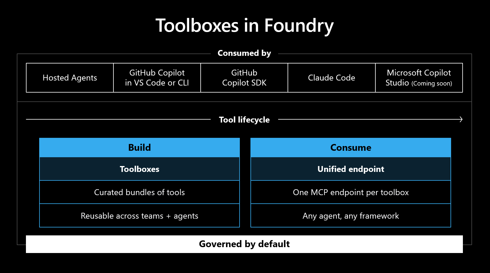

# 10. Foundry Toolboxes



**Estimated time:** 30 minutes

> [!IMPORTANT]
> **Preview notice**: Foundry Toolboxes and Tool Search are currently in **public preview**. Steps and portal UI may change as the feature evolves. See [Supplemental Terms of Use for Microsoft Azure Previews](https://azure.microsoft.com/support/legal/preview-supplemental-terms/).

<!-- markdownlint-disable-next-line MD028 -->
> [!IMPORTANT]
> This capstone module builds on two earlier modules:
>
> - [Module 06 — Integrate MCP tools](../06-mcp-tools/README.md): the `retail_remedy_ops` MCP server must be running and publicly exposed on port 8080.
> - [Module 08 — Use Agent Framework for Python](../08-agent-framework-python/README.md): you consume the toolbox from a Python **Microsoft Agent Framework** app, reusing the client and agent patterns introduced there.

<!-- markdownlint-disable-next-line MD028 -->
> [!NOTE]
> If you could not complete Module 06, start the MCP server and expose port 8080 as described in Module 06, Part 2 before continuing.

<!-- markdownlint-disable-next-line MD028 -->
> [!TIP]
> Tick the checkbox next to each step as you complete it to track your progress through this module.

## Objectives

- Bundle the **Retail Remedy Operations MCP server**, **Web Search**, and **Code Interpreter** into a single **Foundry Toolbox** managed through the portal.
- Enable **Tool Search** so the toolbox exposes tools by intent rather than returning the full tool list.
- Consume the toolbox from a Python **Microsoft Agent Framework** app — the same framework you used in Module 08 — through the toolbox's MCP endpoint.
- Confirm the app produces a correct Australian Consumer Law remedy using Tool Search in its tool calls.

## Concepts

### What is a Foundry Toolbox?

A **Foundry Toolbox** is a centrally managed collection of tools exposed through a single MCP-compatible endpoint. Instead of each agent wiring its own connections, you define the tools once in a toolbox and any agent connects to a single URL.

Key benefits:

| Benefit | Detail |
|---|---|
| **Centralised management** | Rotate credentials, swap servers, or add new tools without redeploying agents |
| **Versioning** | Create a new toolbox version, test it, then promote it to default when ready |
| **Guardrails** | Apply a named RAI content policy to all tool inputs and outputs at the toolbox layer |
| **Discoverability** | Any agent or MCP client in the organisation can reuse the same toolbox endpoint |

### What is Tool Search?

When a toolbox contains many tools, passing all definitions to the model on every turn wastes tokens and dilutes focus. **Tool Search** solves this by replacing the full tool list with two meta-tools:

| Meta-tool | What the model does |
|---|---|
| `tool_search` | Calls with a natural-language description of what it needs; Foundry returns the matching tool definitions |
| `call_tool` | Invokes any tool returned by `tool_search` |

The model never browses a full tool list — it describes intent, discovers the right tools, and calls them. The agent instructions need to tell the model to call `tool_search` when a needed tool is not already visible.

> [!NOTE]
> Tool descriptions drive match quality. A vague or missing description causes poor discovery. Every tool added to the toolbox should have a clear description.

### Why consume the toolbox from code?

A toolbox is exposed as an MCP endpoint secured with Microsoft Entra authentication. Every request — including the connection handshake — must carry an Entra bearer token (scope `https://ai.azure.com/.default`) **and** the preview header `Foundry-Features: Toolboxes=V1Preview`. The Foundry portal's prompt-agent builder cannot yet attach a custom header to an MCP connection, so you consume the toolbox from a small Microsoft Agent Framework app instead. This is the natural next step after Module 08: the same `FoundryChatClient` and `Agent` types, now pointed at a toolbox endpoint.

## Steps

### Part 1 — Verify the MCP server is still running

The toolbox wraps the same `retail_remedy_ops` MCP server set up in Module 06. It must be running and publicly accessible before you create the toolbox.

> [!IMPORTANT]
> **Check the MCP server is running and publicly tunneled before creating the toolbox.** The toolbox's MCP tool points at the `retail_remedy_ops` MCP server from [Module 06](../06-mcp-tools/README.md), which must still be running locally and exposed on a **Public** port 8080 tunnel, with `MCP_SERVER_URL` set to its URL ending in `/mcp`. Complete the two checks below before continuing.

#### 1. Confirm the server is running

- [ ] Check the MCP server terminal. It should still show:

  ```text
  Starting Retail Remedy Operations MCP server on http://0.0.0.0:8080/mcp
  ```

  If not, restart it from a terminal:

  ```bash
  python labs/introduction-foundry-agent-service/06-mcp-tools/src/server.py
  ```

#### 2. Confirm port 8080 is publicly exposed

- [ ] In VS Code, click the **PORTS** tab in the bottom panel.
- [ ] Confirm port `8080` is listed and **Visibility** shows **Public**.
- [ ] Hover over the forwarded address and copy the tunnel URL.
- [ ] Append `/mcp` to the copied URL if it is not already present. For example:

  ```text
  https://abc123-8080.devtunnels.ms/mcp
  ```

- [ ] Save this URL — you will paste it into the toolbox configuration in the next part.

---

### Part 2 — Create the toolbox in the Foundry portal

> [!NOTE]
> The Toolboxes portal UI is in preview. The exact navigation path at [ai.azure.com](https://ai.azure.com) may differ from the steps below as the portal evolves. If **Toolboxes** is not visible in your portal navigation, use the [code fallback](#code-fallback--create-the-toolbox-with-python) at the end of this part.

#### 3. Navigate to Toolboxes

- [ ] In a browser, navigate to [Microsoft Foundry](https://ai.azure.com) and sign in.
- [ ] In the left navigation, click **Build**.
- [ ] Look for a **Toolboxes** entry under **Build** (it may also appear under **Build → Agents → Tools** or **Build → Tools**).
- [ ] Click **Toolboxes** to open the toolbox management view.

  <details>
  <summary>📸 Screenshot: Tools page — Toolboxes tab</summary>

  

  </details>

#### 4. Create a new toolbox

- [ ] Click **+ Create** or **+ New toolbox**.
- [ ] Enter the following details:

  | Field | Value |
  |---|---|
  | Name | `acl-remedy-toolbox` |
  | Description | `Retail Remedy operations tools, web search, and code interpreter for ACCC and ACL guidance` |

  <details>
  <summary>📸 Screenshot: Create toolbox form</summary>

  

  </details>

#### 5. Add the Web Search tool

- [ ] In the tool configuration area, click **+ Add tool**.
- [ ] Select **Web Search** from the tool picker.
- [ ] In the tool **Description** field, enter:

  ```text
  Search the web for ACCC rulings, Australian Consumer Law guidance, and current retail policy information.
  ```

  > This description is used by Tool Search to route queries. Make it specific to what users will ask about.

#### 6. Add the MCP tool

- [ ] Click **+ Add tool** again.
- [ ] Select **MCP** (or **Model Context Protocol** / **Custom MCP**) from the tool picker.
- [ ] Fill in the connection details:

  | Field | Value |
  |---|---|
  | Label / Server name | `retail_remedy_ops` |
  | Server URL | Your tunnel URL ending in `/mcp` |
  | Authentication | None / Anonymous |
  | Description | `Retail Remedy Operations tools for looking up purchases, product profiles, store policies, replacement options, and creating remedy cases.` |

- [ ] Confirm the six MCP tools are discovered from the running server: `lookup_purchase`, `get_product_profile`, `search_store_policy`, `find_replacement_options`, `draft_remedy_summary`, `create_remedy_case`.

  <details>
  <summary>📸 Screenshot: MCP tool added to the toolbox</summary>

  

  </details>

  <details>
  <summary>📸 Screenshot: Toolbox detail with the MCP server</summary>

  

  </details>

#### 7. Add the Code Interpreter tool

- [ ] Click **+ Add tool** again.
- [ ] Select **Code Interpreter** from the tool picker.

  > Code Interpreter runs calculations such as pro-rata refund amounts. Including it in the toolbox keeps every capability the app needs behind the single toolbox endpoint.

  <details>
  <summary>📸 Screenshot: Adding Code Interpreter to the toolbox</summary>

  

  </details>

- [ ] Confirm the toolbox now lists all three tools: **Web Search**, the `retail_remedy_ops` MCP server, and **Code Interpreter**.

  <details>
  <summary>📸 Screenshot: Toolbox with three tools</summary>

  

  </details>

#### 8. Enable Tool Search

- [ ] Look for a **Tool search** toggle or checkbox in the toolbox configuration.
- [ ] Enable it.

  > Enabling Tool Search adds the `toolbox_search_preview` configuration to the toolbox version. This hides the individual tools from the initial `tools/list` response and exposes them through `tool_search` instead, keeping the consuming app's active tool context small.

#### 9. Publish the toolbox and set it as the default version

- [ ] Click **Publish** (or **Save** / **Create**).
- [ ] Confirm a toolbox named `acl-remedy-toolbox` is created.
- [ ] Confirm the published version is set as the **default** version. The consumer endpoint resolves `?api-version=v1` to the default version, so this must be set for the app in Part 3 to connect.

  <details>
  <summary>📸 Screenshot: Toolbox published and set as default</summary>

  

  </details>

  <details>
  <summary>📸 Screenshot: Toolbox saved with three tools as the default version</summary>

  

  </details>

#### 10. Copy the toolbox MCP endpoint

- [ ] After publishing, locate the **Consumer endpoint** URL for `acl-remedy-toolbox`. It has the form:

  ```text
  https://<account>.services.ai.azure.com/api/projects/<project>/toolboxes/acl-remedy-toolbox/mcp?api-version=v1
  ```

  The app in Part 3 builds this URL automatically from `FOUNDRY_PROJECT_ENDPOINT` and `TOOLBOX_NAME`, so you do not need to paste it anywhere — but confirm it matches the endpoint shown in the portal.

#### Code fallback — Create the toolbox with Python

> [!TIP]
> If the portal does not expose Toolboxes in your region yet, or you skipped the steps above, run the fallback script to create the toolbox through the Python SDK. The MCP server must be running and `MCP_SERVER_URL` must be set in your `.env` file.
>
> ```bash
> python labs/introduction-foundry-agent-service/10-foundry-toolboxes/solution/setup_toolbox.py
> ```
>
> The script creates the `acl-remedy-toolbox` toolbox with Web Search, the `retail_remedy_ops` MCP server, Code Interpreter, and Tool Search enabled, then prints the consumer endpoint URL. Set the new version as the default in the portal if it is not already, then continue with Part 3.

---

### Part 3 — Consume the toolbox with the Microsoft Agent Framework

You consume the toolbox from a Python **Microsoft Agent Framework** app. The app builds a `FoundryChatClient` and `Agent` (as in Module 08), but points the agent's tool at the toolbox's MCP endpoint. It supplies the Entra bearer token and the `Foundry-Features: Toolboxes=V1Preview` header on every request, including the connection handshake.

#### 11. Activate the environment and sign in

- [ ] Activate the `.venv` virtual environment from the repository root:

  - **Windows (PowerShell):** `.venv\Scripts\Activate.ps1`
  - **macOS / Linux:** `source .venv/bin/activate`

- [ ] Confirm you are signed in with the Azure CLI — the app authenticates with `DefaultAzureCredential`, which relies on your CLI session:

  ```bash
  az login
  ```

#### 12. Confirm the required environment variables

- [ ] Confirm your `.env` file (or `azd env get-values`) sets:

  | Variable | Value |
  |---|---|
  | `FOUNDRY_PROJECT_ENDPOINT` | Your Foundry project endpoint |
  | `TOOLBOX_NAME` | `acl-remedy-toolbox` |

  > The app builds the toolbox MCP endpoint as `{FOUNDRY_PROJECT_ENDPOINT}/toolboxes/{TOOLBOX_NAME}/mcp?api-version=v1`.

#### 13. Review the consumer script

- [ ] Open `solution/consume_toolbox.py` and review how it consumes the toolbox:
  - It wraps the toolbox MCP endpoint in an `MCPStreamableHTTPTool`, backed by an `httpx.AsyncClient` that adds the Entra bearer token and the `Foundry-Features` header to every request.
  - It builds a `FoundryChatClient` and an `Agent` whose instructions tell the model to call `tool_search` when a needed tool is not already visible.
  - It retries the connection a few times, because the toolbox endpoint can intermittently drop the first connection attempt on a cold start.

#### 14. Run the consumer script

- [ ] Run the script from the repository root:

  ```bash
  python labs/introduction-foundry-agent-service/10-foundry-toolboxes/solution/consume_toolbox.py
  ```

- [ ] The script sends a built-in Australian Consumer Law scenario for receipt `R-1007` (a laptop battery that has failed early) and prints the agent's remedy recommendation.

#### 15. Confirm Tool Search drove the response

- [ ] Confirm the script completes and prints a remedy recommendation that:
  - References the customer's purchase and the relevant store policy retrieved through the `retail_remedy_ops` tools.
  - Applies Australian Consumer Law reasoning (a major or minor failure and the appropriate remedy).
  - Includes a calculated figure (such as a pro-rata refund) produced by Code Interpreter.

  > Because Tool Search is enabled, the agent first calls `tool_search` to discover the retail tools, then calls them through `call_tool` — it never receives the full tool list up front.

---

## Validation

- The `acl-remedy-toolbox` toolbox exists in your Foundry project containing **Web Search**, the `retail_remedy_ops` MCP server, and **Code Interpreter**, with **Tool Search** enabled and a default version set.
- `python labs/introduction-foundry-agent-service/10-foundry-toolboxes/solution/consume_toolbox.py` connects to the toolbox endpoint and runs to completion without error.
- The printed response includes a clear remedy recommendation citing store policy and Australian Consumer Law.
- The response includes a calculated figure (such as a pro-rata refund) from Code Interpreter, confirming the toolbox exposed all three tools through Tool Search.

## Congratulations 🎉

You packaged your tools for reuse. You assembled an `acl-remedy-toolbox` that exposes **Web Search**, the `retail_remedy_ops` MCP server, and **Code Interpreter** through a single Tool Search–enabled endpoint, then consumed it from a Python Microsoft Agent Framework app — proving one toolbox can serve all three tools to any agent. This is the capstone pattern for sharing curated capabilities across teams.

> [!TIP]
> **Next up → [Module 11: Agent operations and Agent ID](../11-agent-ops-and-agent-id/README.md)**
> Operationalize your agent with monitoring, run history, and Agent ID. No need to scroll — jump straight in!

## Troubleshooting

- **Toolboxes not visible in the portal:** This preview feature may not appear in all regions or portal versions. Use the Python SDK fallback script (`solution/setup_toolbox.py`) to create the toolbox, then continue with Part 3.
- **`MCP server failed to initialize` / `Cancelled via cancel scope`:** The toolbox endpoint can drop the first connection attempt on a cold start. The script already retries a few times with a short backoff — let it run. If every attempt fails, confirm the toolbox has a default version set and that the MCP server is still running and publicly exposed.
- **Authentication fails:** The app uses `DefaultAzureCredential`, which relies on your Azure CLI session. Run `az login` in the terminal to re-authenticate, then retry. Confirm your account has access to the Foundry project.
- **Empty or unhelpful response:** Tool descriptions drive `tool_search` discovery. Confirm the Web Search and MCP tools have clear, specific descriptions in the toolbox definition. Publish a new toolbox version with improved descriptions and set it as the default.
- **MCP tools not discovered during toolbox creation:** Confirm the MCP server is running and the tunnel URL is still publicly accessible. Restart the server and re-expose port 8080 if needed, then re-create the toolbox with the updated URL.
- **Wrong toolbox is used:** The app resolves the toolbox by `TOOLBOX_NAME` and uses the default version. Confirm `TOOLBOX_NAME=acl-remedy-toolbox` in your `.env` file and that the intended version is set as the default in the portal.
